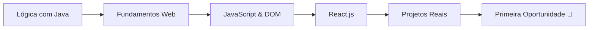

<div align="center">
  
# 👋 Olá! Eu sou o Jean

### Desenvolvedor Front-end | Buscando primeira oportunidade na área

</div>

---

## 🎯 Sobre mim

🚀 Desenvolvedor Front-end em formação com foco em criar **interfaces modernas, responsivas e acessíveis**  
💼 Em busca da **primeira oportunidade profissional** para aplicar conhecimentos e evoluir em equipe  
📚 Estudante de **Análise e Desenvolvimento de Sistemas**  
🔄 Transição estratégica de Java para Front-end, aplicando base sólida em lógica de programação

> *"Aprendendo todos os dias. Codando com propósito."*

---

## 🛠️ Stack Tecnológica

**Front-end**
```
HTML5  •  CSS3  •  JavaScript (ES6+)  •  React.js
Flexbox  •  Grid  •  Design Responsivo  •  APIs REST
```

**Ferramentas & Versionamento**
```
Git & GitHub  •  VS Code  •  Figma (básico)
```

**Estudando atualmente**
```
React Native  •  Expo  •  TypeScript  •  Styled Components
```

---

## 💻 O que eu faço

✅ Desenvolvo aplicações web responsivas do zero  
✅ Crio componentes reutilizáveis com React  
✅ Integro aplicações com APIs externas  
✅ Escrevo código limpo seguindo boas práticas  
✅ Versiono projetos com Git de forma organizada  

---

## 📊 GitHub Stats

<div align="center">
  


</div>

---

## 🎯 Projetos em Destaque

<div align="center">

| Projeto | Descrição | Tech Stack |
|---------|-----------|------------|
| **[📱 Nome Projeto 1](#)** | Landing page responsiva de agência | HTML, CSS, JS |
| **[⚛️ Nome Projeto 2](#)** | CRUD de tarefas com React | React, Hooks, API |
| **[🎨 Nome Projeto 3](#)** | Clone de interface Netflix | React, CSS Modules |
| **[🌦️ Nome Projeto 4](#)** | App de clima com API | JavaScript, Fetch API |

</div>

> 💡 **Todos os projetos possuem README detalhado, estão deployados e demonstram evolução técnica progressiva**

---

## 🎓 Formação & Background

**🎓 Graduação em andamento**  
Análise e Desenvolvimento de Sistemas

**💡 Base Técnica**  
Iniciei estudos com **Java** para desenvolver fundamentos sólidos em:
- Lógica de programação
- Estruturas de dados  
- Orientação a objetos
- Resolução de problemas

**🎯 Foco Atual: 100% Front-end**  
Direcionei minha carreira para desenvolvimento de interfaces, onde encontrei minha verdadeira paixão: **criar experiências visuais que impactam pessoas**.

---

## 📈 Minha Jornada


---

## 🌟 Diferenciais

- ✨ Código limpo e bem documentado
- 🎨 Atenção aos detalhes de UI/UX
- 📱 Mobile-first em todos os projetos
- 🧩 Capacidade de aprender rápido
- 🤝 Boa comunicação e trabalho em equipe
- 📊 Organização com Git (commits semânticos)

---

## 📫 Vamos conversar?

<div align="center">

[](https://www.linkedin.com/in/jeancaio/)
[](mailto:jeancaiocs@gmail.com)
[](SEU-PORTFOLIO)

</div>

---

<div align="center">

### 💼 Disponível para oportunidades Júnior em Front-end

**📧 Email:** seu-email@exemplo.com  
**📍 Localização:** Umuarama, PR - Brasil  
**🕐 Disponibilidade:** Imediata

---

*⭐ Se você é recrutador(a) e chegou até aqui, adoraria bater um papo sobre como posso contribuir com seu time!*

</div>
